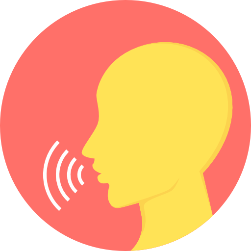
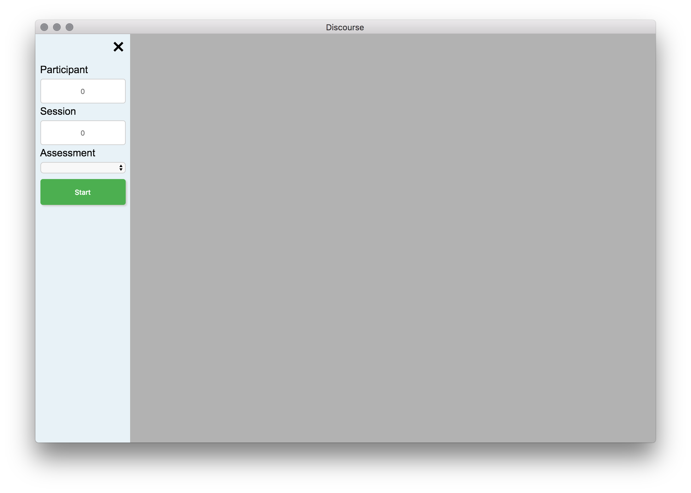
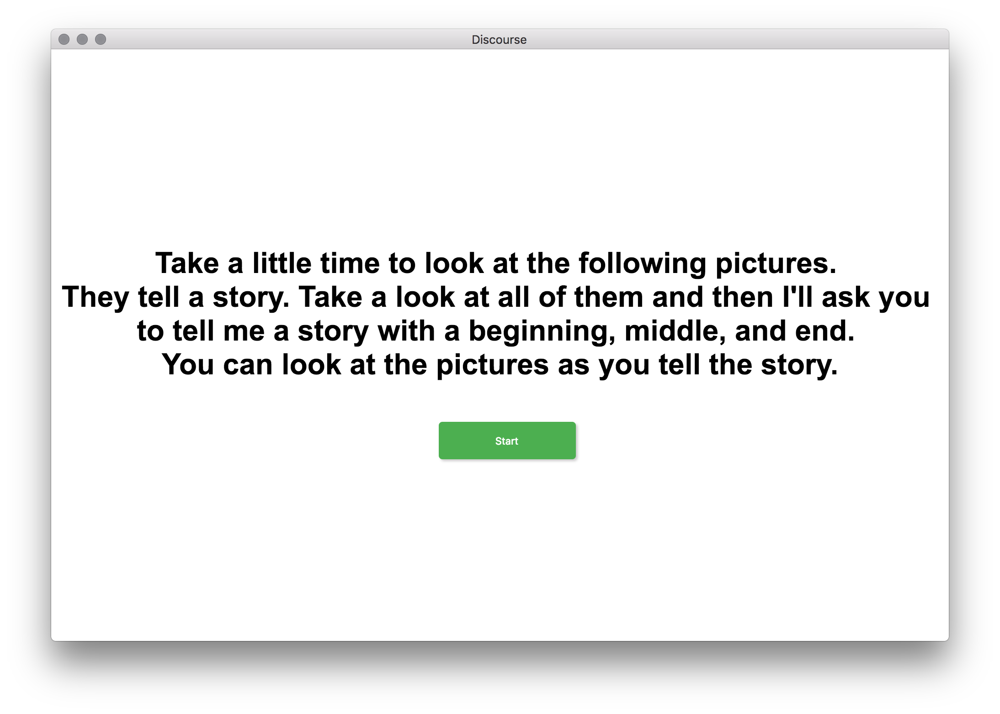
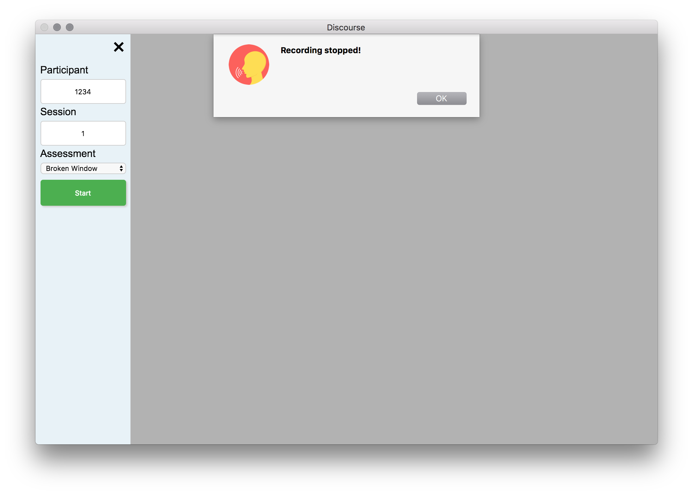

# Discourse Assessments

##### Dowload the [latest version](https://github.com/hanayik/Discourse-Assessments/releases/latest)

### Description
These assessments have been used in past research studies on speech output abilities after stroke. They are designed to engage participants in fluent speech production rather than simply naming or repeating. The app will record video of each assessment as the participant performs the tasks.

The saved video location will depend on your computer. The program automatically detects if you have Dropbox, or Box folders on your computer and tries to save to those locations first, in that order. If you do not wish to save to the cloud folders then uncheck that option in the menu bar. If the cloud saving option is unchecked, or those folders do not exist on your computer then the app will save to it's default MacOS location which is ``` ~/Library/Application Support/Discourse-Assessments/data ```

### Making a PBJ

The participant is shown an image of a peanut-butter and jelly sandwich and is asked to describe how they would make the sandwich in a step by step manner.

### Picnic Scene Description

The picnic scene is from the Western Aphasia Battery. The participant is asked to describe as many elements in the scene as possible. They may tell a story about what is happening or simply describe the picture in a list-wise manner.  

### Broken Window Description

The broken window description assessment is used to get participants to describe the order of events from one image to the next (there's a set of 4). They should try to tell a story about what has happened to the window.

### Telling the Story of Cinderella

Participants view images from the cinderella storybook and then attempt to narrate the story on their own without the pictures as a guide. The pictures can be "flipped" through by using the left and right arrow keys on the keyboard.   

### Screenshots








### Credits
[Icon](http://www.flaticon.com/authors/popcorns-arts)

### License
[MIT](https://github.com/hanayik/Discourse-Assessments/blob/master/LICENSE)

This app was made specifically for the CSTAR group, but is open source so that others may modify and use as desired.

### Developers
This app is currently only developed for MacOS, and a compiled version of ffmpeg is bundled with the app. 

##### To clone repo:

``` cd /to/your/desired/install/location ```

``` git clone https://github.com/hanayik/Discourse-Assessments.git ```

##### To install packages:

``` cd Discourse-Assessments ```

``` npm install ```

##### To run

``` npm start ```


### Links
[CSTAR](https://cstar.sc.edu/)

[Aphasia Lab](https://web.asph.sc.edu/aphasia/)

##### Disclaimer
I do not own the picture contents of any assessment material. Everything is provided free of charge and without guarantee of usability and accuracy. All images were found online in the public domain.
